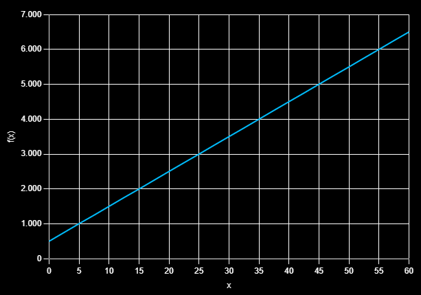
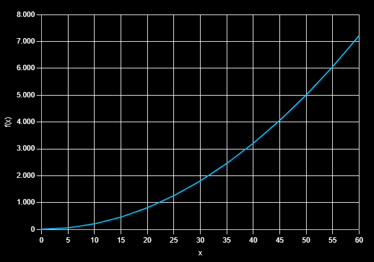

## 1. Considere as equações de tempo de execução dos algoritmos A e B a seguir
- T(A) = 100n + 500
- T(B) = 2n² + 10

#### a) Determine para quais faixas de valores A é melhor do que B e B é melhor do que A, considerando eficiência temporal.
##### A é mais eficiente a partir de n igual 55, para n menor que 55, B é mais eficiente 

#### b) Desenhe o gráfico das funções dos algoritmos A e B.

