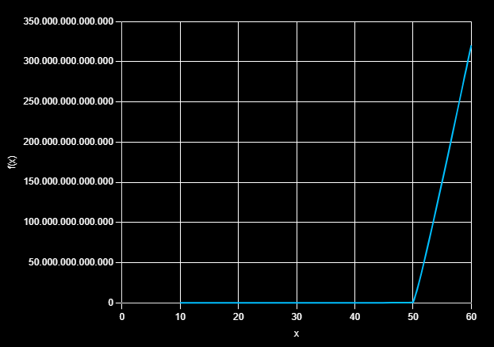
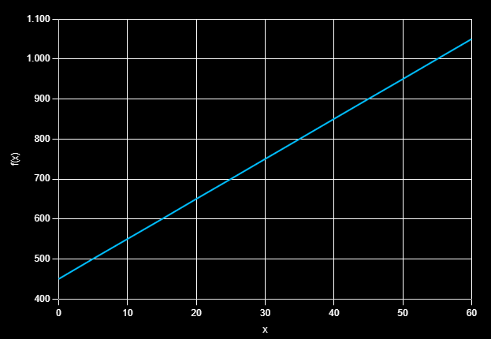
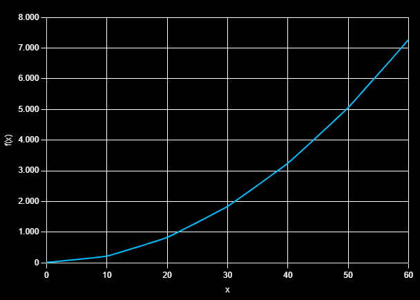
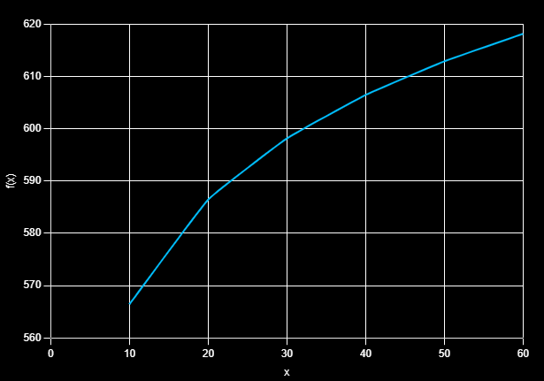

## 2. Sejam 4 diferentes algoritmos com as equações de tempo de execução a seguir:
- a) (2 ** n/n ** 2) - n + 10
- b) 10 * n + 450
- c) 10 + 2 * n ** 2 + n
- d) 500 + 20 * log2(n)

#### a) Preencha a tabela a seguir e classifique os algoritmos do melhor (mais rápido) para o pior.
 Entrada | 2 | 4 | 6 | 8 | 10 | 12 | 14 | 16 | 18 | 20
 ----: |  ----: |  ----: |  ----: |  ----: |  ----: |  ----: |  ----: |  ----: |  ----: |  ----: 
 algo a | 9 | 7 | 5.777777777777778 | 6 | 10.24 | 26.444444444444443 | 79.59183673469387 | 250 | 801.0864197530864 | 2611.44 
 algo b | 470 | 490 | 510 | 530 | 550 | 570 | 590 | 610 | 630 | 650
 algo c | 20 | 46 | 88 | 146 | 220 | 310 | 416 | 538 | 676 | 830
 algo d | 520 | 540 | 551.6992500144231 | 551.6992500144231 | 560 | 566.4385618977473 | 571.6992500144231 | 576.1470984411521 |580 | 583.3985000288462 | 586.4385618977473 

#### b) Faça um gráfico com as 4 equações.
##### a:

##### b:

##### c:

##### d:

