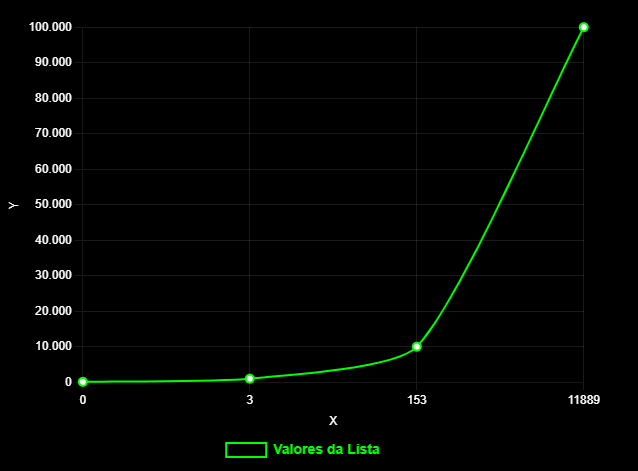

## Q2
### (a) 
#### 2 laços, onde um percorrera todos os n elementos do array e o segundo pegara todos os elementos apos o elemento atual do primeiro laço. No segundo laço se deve vericar soma o elemento do primeiro laço com o do segundo é igual ao valor de S, se for igual retorna true. apos os laços retorne false.
```bash
N = 4, S = 2
v[0] = 10
v[1] = 1
v[2] = 2
v[3] = 0

v[0]
  v[1] não igual 
  v[2] não igual
  v[3] não igual

v[1]
  v[2] não igual
  v[3] não igual

v[2]
  v[3] retorna true
```

### (b) 
#### O(n²)

### (c)
```cpp
bool soma_array(int vetor[], int& n, int& s){
    for (int i = 0; i < n; i++) // n
        for (int j = i + 1; j < n; j++) // n - 1
            if (vetor[i] + vetor[j] == s) // 2
                return true;  // 1
    return false;
}
```

### (d)
```cpp
#include <iostream>

bool soma_array(int vetor[], int& n, int& s){
    for (int i = 0; i < n; i++)
        for (int j = i + 1; j < n; j++)
            if (vetor[i] + vetor[j] == s) 
                return true;
    return false;
}

int main(){
    int n, s;
    std::cin >> n >> s;
    int vetor[n];
    for (int i = 0; i < n; i++) std::cin >> vetor[i];
    std::cout << (soma_array(vetor, n, s) ? "Existe" : "Não existe") << std::endl;
    return 0;
}
```

### (e)
N | Tempo(milisegundos)
:-----:|:-----:
100 | 0
1000 | 3
10000 | 153
100000 | 11889


### (f)
